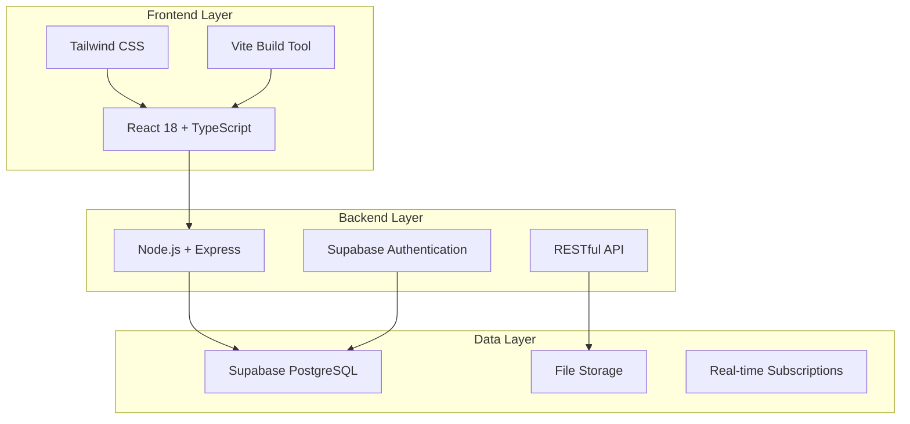

<div align="center">

# 💰 **Expense Management System**
### *The Ultimate Financial Tracking Solution*

[](https://youtu.be/wuV864I_mPE?si=IJmWTjs5lYe97XaQ)
[](LICENSE)
[](https://nodejs.org/)
[](https://reactjs.org/)
[](https://supabase.com/)

---

### 🚀 **Transform Your Financial Management Experience**

*A cutting-edge, full-stack expense management application designed for modern businesses and individuals who demand excellence in financial tracking and approval workflows.*

</div>

---

## 🎯 **Key Features**

<div align="center">

| 🔐 **Authentication** | 💼 **Expense Management** | 📊 **Analytics** | ⚡ **Workflow** |
|:---:|:---:|:---:|:---:|
| Secure Supabase Auth | Create & Track Expenses | Visual Dashboard | Multi-level Approvals |
| Multi-tenant Support | Receipt OCR Scanning | Real-time Reports | Role-based Access |
| Session Management | Multi-currency Support | Export Capabilities | Automated Notifications |

</div>

### ✨ **Complete Feature Set**

#### 🏢 **Enterprise-Grade Authentication**
- 🔒 **Secure Login/Signup** - Powered by Supabase authentication
- 🏛️ **Multi-tenant Architecture** - Company-based user isolation
- 👥 **Role Management** - Admin, Manager, and Employee roles
- 🔑 **Session Handling** - Automatic token refresh and validation

#### 💳 **Advanced Expense Tracking**
- ➕ **Quick Expense Creation** - Intuitive form with smart validation
- 📱 **Receipt Scanning** - AI-powered OCR for automatic data extraction
- 🌍 **Multi-currency Support** - Real-time exchange rate conversion
- 📂 **Smart Categorization** - Customizable expense categories
- 📅 **Date Tracking** - Comprehensive expense timeline

#### 📈 **Powerful Analytics & Reporting**
- 📊 **Interactive Dashboard** - Real-time expense visualization
- 📉 **Trend Analysis** - Monthly and yearly spending patterns
- 💹 **Budget Tracking** - Set and monitor spending limits
- 📋 **Export Reports** - PDF and Excel export capabilities
- 🎯 **Custom Filters** - Advanced search and filtering options

#### ⚙️ **Intelligent Approval Workflow**
- 🔄 **Multi-level Approvals** - Configurable approval chains
- ⏰ **Automated Notifications** - Email and in-app alerts
- 💬 **Comment System** - Approval/rejection with feedback
- 📝 **Audit Trail** - Complete approval history tracking
- 🎛️ **Flexible Rules** - Percentage and amount-based approval rules

#### 🎨 **Modern User Experience**
- 🌟 **Responsive Design** - Perfect on all devices
- 🎭 **Dark/Light Mode** - Customizable themes
- ⚡ **Lightning Fast** - Optimized performance
- 🔔 **Real-time Updates** - Live data synchronization
- 🧭 **Intuitive Navigation** - User-friendly interface

---

## 🏗️ **Architecture Overview**

<div align="center">



</div>

---

## 📁 **Project Structure**

```
📦 Expense_Frontend_v_01/
├── 🎬 README.md                    # You are here!
├── 📋 package.json                 # Root dependencies
├── ⚙️ scripts/                     # Development scripts
│   ├── 🚀 start-dev.js            # Concurrent server starter
│   └── 🔧 setup.js                # Interactive setup guide
│
├── 🔙 Backend/                     # Node.js + Express API
│   ├── 📦 package.json            # Backend dependencies
│   ├── 🌍 .env                    # Environment variables
│   ├── 📚 SETUP.md                # Backend setup guide
│   ├── 🗂️ src/
│   │   ├── 🚀 server.js           # Express server entry
│   │   ├── ⚙️ config/             # Configuration files
│   │   │   ├── 🗄️ database.sql    # Database schema
│   │   │   └── 🔗 supabase.js     # Supabase client
│   │   ├── 🎛️ controllers/        # Business logic
│   │   │   ├── 🔐 authController.js
│   │   │   ├── 💳 expenseController.js
│   │   │   ├── 👤 userController.js
│   │   │   ├── ✅ approvalController.js
│   │   │   └── 💱 currencyController.js
│   │   ├── 🛡️ middleware/          # Express middleware
│   │   │   ├── 🔒 auth.js          # Authentication
│   │   │   └── 📤 upload.js        # File upload
│   │   ├── 🛣️ routes/              # API routes
│   │   │   ├── 🔐 auth.js
│   │   │   ├── 💳 expenses.js
│   │   │   ├── 👥 users.js
│   │   │   ├── ✅ approvals.js
│   │   │   └── 💱 currency.js
│   │   └── 🔧 utils/               # Utility functions
│   │       ├── 💱 currency.js
│   │       └── 👁️ ocr.js           # Receipt scanning
│   └── 📜 scripts/                 # Database scripts
│       └── 🏗️ init-db.js          # Database initialization
│
└── 🎨 Frontend/                    # React + TypeScript SPA
    ├── 📦 package.json            # Frontend dependencies
    ├── 🌍 .env                    # Environment variables
    ├── ⚡ vite.config.ts          # Vite configuration
    ├── 🎯 tsconfig.json           # TypeScript config
    ├── 🎨 tailwind.config.js      # Tailwind CSS config
    ├── 🗂️ src/
    │   ├── 🚀 main.tsx            # Application entry
    │   ├── 📱 App.tsx             # Root component
    │   ├── 🎨 index.css           # Global styles
    │   ├── 🧩 components/         # React components
    │   │   ├── 🔐 Auth/           # Authentication UI
    │   │   │   ├── 🚪 LoginPage.tsx
    │   │   │   └── 📝 SignupPage.tsx
    │   │   ├── 👤 Employee/       # Employee dashboard
    │   │   │   ├── 🏠 EmployeeDashboard.tsx
    │   │   │   ├── ➕ ExpenseForm.tsx
    │   │   │   └── 📊 ExpenseTable.tsx
    │   │   ├── 👨‍💼 Manager/         # Manager interface
    │   │   │   ├── 🏠 ManagerDashboard.tsx
    │   │   │   └── ✅ ApprovalQueue.tsx
    │   │   ├── 👑 Admin/          # Admin panel
    │   │   │   ├── 🏠 AdminDashboard.tsx
    │   │   │   ├── 👥 UserManagement.tsx
    │   │   │   └── ⚙️ ApprovalRules.tsx
    │   │   ├── 📊 Charts/         # Data visualization
    │   │   │   ├── 📈 ExpenseChart.tsx
    │   │   │   └── 🟢 ExpenseStatusChart.tsx
    │   │   ├── 🎨 ui/             # Reusable UI components
    │   │   └── 🖼️ Layout/         # Layout components
    │   ├── 🌐 contexts/           # React contexts
    │   │   ├── 🔐 AuthContext.tsx
    │   │   ├── 💳 ExpenseContext.tsx
    │   │   └── 💱 CurrencyContext.tsx
    │   ├── 🔧 lib/                # Utilities & API
    │   │   └── 🌐 api.ts          # API client
    │   └── 📝 types/              # TypeScript definitions
    │       └── 📋 index.ts
    └── 🎯 Features.md             # Detailed feature docs
```

---

## 🚀 **Quick Start Guide**

### 📋 **Prerequisites**

<div align="center">

| Requirement | Version | Download |
|:---:|:---:|:---:|
| 🟢 **Node.js** | 18+ | [Download](https://nodejs.org/) |
| 📦 **npm** | Latest | Included with Node.js |
| 🗄️ **Supabase Account** | Free Tier | [Sign Up](https://supabase.com) |

</div>

### ⚡ **Installation**

```bash
# 1️⃣ Clone the repository
git clone https://github.com/yourusername/expense-management-system.git
cd expense-management-system

# 2️⃣ Install all dependencies
npm run install-all

# 3️⃣ Set up environment variables
cp Backend/.env.example Backend/.env
cp Frontend/.env.example Frontend/.env

# 4️⃣ Configure Supabase credentials in Backend/.env
# SUPABASE_URL=https://your-project-id.supabase.co
# SUPABASE_ANON_KEY=your_anon_key
# SUPABASE_SERVICE_ROLE_KEY=your_service_role_key

# 5️⃣ Initialize the database
cd Backend && npm run init-db

# 6️⃣ Start the development servers
cd .. && npm run dev
```

### 🌐 **Access Points**

<div align="center">

| Service | URL | Description |
|:---:|:---:|:---:|
| 🎨 **Frontend** | http://localhost:5173 | Main application |
| 🔙 **Backend API** | http://localhost:5000/api | REST API |
| 🏥 **Health Check** | http://localhost:5000/health | Server status |

</div>

---

## 🛠️ **Technology Stack**

<div align="center">

### 🎨 **Frontend Technologies**

[](https://reactjs.org/)
[](https://typescriptlang.org/)
[](https://vitejs.dev/)
[](https://tailwindcss.com/)

### 🔙 **Backend Technologies**

[](https://nodejs.org/)
[](https://expressjs.com/)
[](https://supabase.com/)
[](https://postgresql.org/)

### 🔧 **Development Tools**

[](https://eslint.org/)
[](https://prettier.io/)
[](https://git-scm.com/)

</div>

---

## 📚 **API Documentation**

### 🔐 **Authentication Endpoints**

| Method | Endpoint | Description | Auth Required |
|:---:|:---:|:---|:---:|
| `POST` | `/api/auth/signup` | Create new user account | ❌ |
| `POST` | `/api/auth/login` | User authentication | ❌ |
| `GET` | `/api/auth/me` | Get current user | ✅ |
| `POST` | `/api/auth/logout` | End user session | ✅ |

### 💳 **Expense Management**

| Method | Endpoint | Description | Auth Required |
|:---:|:---:|:---|:---:|
| `GET` | `/api/expenses` | List all expenses | ✅ |
| `POST` | `/api/expenses` | Create new expense | ✅ |
| `PUT` | `/api/expenses/:id` | Update expense | ✅ |
| `DELETE` | `/api/expenses/:id` | Delete expense | ✅ |
| `POST` | `/api/expenses/scan-receipt` | OCR receipt scanning | ✅ |

### ✅ **Approval Workflow**

| Method | Endpoint | Description | Auth Required |
|:---:|:---:|:---|:---:|
| `GET` | `/api/approvals/workflows` | Get approval workflows | ✅ |
| `POST` | `/api/approvals/expenses/:id/approve` | Approve expense | ✅ |
| `POST` | `/api/approvals/expenses/:id/reject` | Reject expense | ✅ |
| `GET` | `/api/approvals/rules` | Get approval rules | ✅ |

---

## 🎯 **Development Scripts**

<div align="center">

| Command | Description |
|:---:|:---|
| `npm run dev` | 🚀 Start both frontend and backend servers |
| `npm run setup` | ⚙️ Interactive application setup |
| `npm run backend` | 🔙 Start only backend server |
| `npm run frontend` | 🎨 Start only frontend server |
| `npm run install-all` | 📦 Install all dependencies |

</div>

---

## 🔧 **Configuration**

### 🌍 **Environment Variables**

#### Backend (.env)
```env
# Server Configuration
PORT=5000
NODE_ENV=development
FRONTEND_URL=http://localhost:5173

# Supabase Configuration
SUPABASE_URL=https://your-project-id.supabase.co
SUPABASE_ANON_KEY=your_supabase_anon_key
SUPABASE_SERVICE_ROLE_KEY=your_supabase_service_role_key

# External APIs
EXCHANGE_RATE_API_URL=https://api.exchangerate-api.com/v4/latest
COUNTRIES_API_URL=https://restcountries.com/v3.1/all
```

#### Frontend (.env)
```env
# API Configuration
VITE_API_URL=http://localhost:5000/api

# Supabase Configuration (if needed)
VITE_SUPABASE_URL=https://your-project-id.supabase.co
VITE_SUPABASE_ANON_KEY=your_supabase_anon_key
```

---

## 🚨 **Troubleshooting**

<details>
<summary>🔴 <strong>Connection Refused Error</strong></summary>

**Problem:** `net::ERR_CONNECTION_REFUSED`

**Solutions:**
1. Ensure backend server is running on port 5000
2. Check if ports are available
3. Verify environment variables are correct
4. Restart both servers: `npm run dev`
</details>

<details>
<summary>🔑 <strong>Authentication Issues</strong></summary>

**Problem:** `Invalid API key` or `401 Unauthorized`

**Solutions:**
1. Verify Supabase credentials in `.env`
2. Check service role key permissions
3. Ensure database schema is initialized
4. Run: `cd Backend && npm run init-db`
</details>

<details>
<summary>🗄️ <strong>Database Connection Problems</strong></summary>

**Problem:** Database errors or schema issues

**Solutions:**
1. Check Supabase project status
2. Verify network connectivity
3. Run database initialization script
4. Check SQL Editor in Supabase dashboard
</details>

---

## 📈 **Performance Features**

<div align="center">

| Feature | Description | Benefit |
|:---:|:---|:---|
| ⚡ **Hot Reload** | Instant development feedback | Faster development |
| 🗜️ **Code Splitting** | Optimized bundle loading | Better performance |
| 📱 **PWA Ready** | Progressive Web App support | Mobile-like experience |
| 🔄 **Real-time Updates** | Live data synchronization | Enhanced UX |
| 🎯 **Lazy Loading** | On-demand component loading | Reduced initial load |

</div>

---

## 🤝 **Contributing**

We welcome contributions! Please see our [Contributing Guidelines](CONTRIBUTING.md) for details.

1. 🍴 **Fork** the repository
2. 🌿 **Create** a feature branch: `git checkout -b feature/amazing-feature`
3. 💾 **Commit** your changes: `git commit -m 'Add amazing feature'`
4. 📤 **Push** to the branch: `git push origin feature/amazing-feature`
5. 🔄 **Submit** a Pull Request

---

## 📄 **License**

This project is licensed under the MIT License - see the [LICENSE](LICENSE) file for details.

---

## 🙏 **Acknowledgments**

<div align="center">

Special thanks to:
- 🚀 **[Supabase](https://supabase.com/)** for the amazing backend infrastructure
- ⚛️ **[React Team](https://reactjs.org/)** for the incredible frontend framework
- 🎨 **[Tailwind CSS](https://tailwindcss.com/)** for the beautiful styling system
- ⚡ **[Vite](https://vitejs.dev/)** for the lightning-fast build tool

</div>

---

<div align="center">

### 💡 **Made with ❤️ for Modern Financial Management**

*Transform your expense tracking experience today!*

[](https://github.com/yourusername/expense-management-system)
[](https://github.com/yourusername/expense-management-system/issues)
[](https://github.com/yourusername/expense-management-system/issues)

---

**📞 Questions? Reach out to us!**

[](mailto:your-email@example.com)
[](https://linkedin.com/in/yourprofile)
[](https://twitter.com/yourhandle)

</div>
